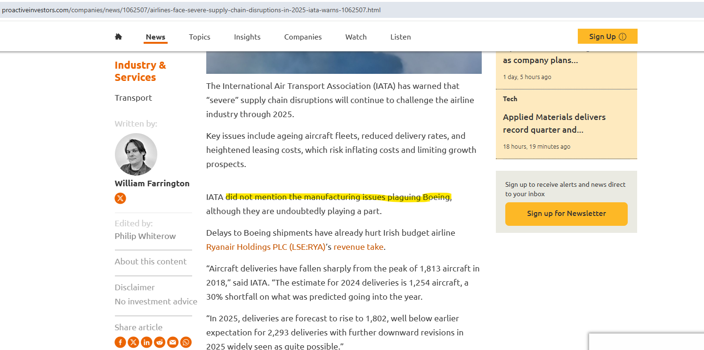
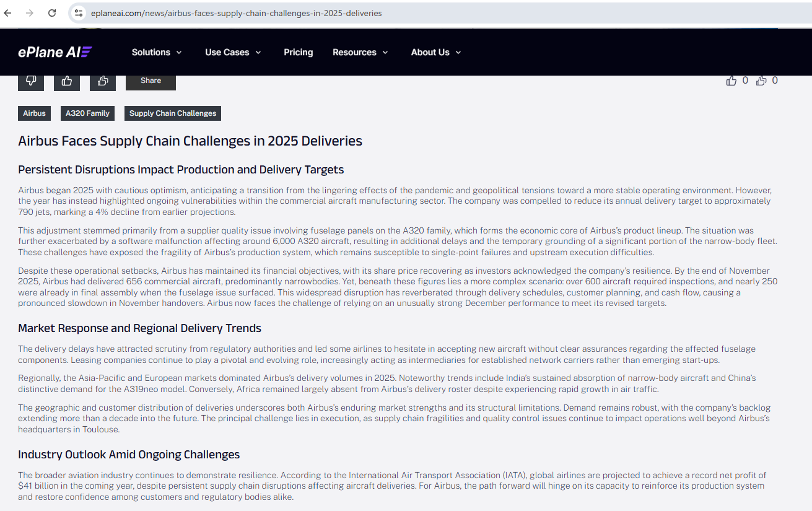

# LAB | Autonomous Agent Challenge

**Result in Terminal:**

* First test:

=======================================================
  Vendor Risk Agent — Minimal Prototype
=======================================================

[Node 1 — fetch_news]
  Searching: Boeing supply chain risk financial news 2025
  Found 3 result(s)
  · https://www.proactiveinvestors.com/companies/news/1062507/airlines-face-severe-supply-chain-disruptions-in-2025-iata-warns-1062507.html
  · https://leehamnews.com/2026/01/27/boeing-fy2025-company-posts-small-profit-on-services-division-bca-still-losing-money/
  · https://sherwood.news/markets/boeing-touts-supply-chain-improvements-making-progress-in-its-war-on-defects/

[Node 2 — classify]
  Classifying risk for: Boeing

=======================================================
  RESULT
=======================================================
  Vendor   : Boeing
  Severity : MEDIUM
  Evidence : The International Air Transport Association (IATA) has warned of 'severe' supply chain disruptions affecting the airline industry through 2025, which includes issues related to Boeing's manufacturing. Although Boeing is working to improve its supply chain relationships, delays in shipments have already impacted airlines like Ryanair, indicating potential instability in delivery schedules.
  Action   : Monitor Boeing's production updates closely and consider diversifying suppliers to mitigate potential delivery risks.
=======================================================

What to check after running:
  1. Node 1 printed search URLs  →  Tavily is working
  2. Node 2 produced a severity  →  LLM classification is working
  3. Evidence references a real news detail  →  not hallucinated
  4. Change TEST_VENDOR name and re-run  →  agent generalises

What this prototype does NOT have yet (full agent has these):
  - RAG over internal contracts
  - Conditional routing (alert vs. skip)
  - Flask server for n8n to call
  - Scheduling and deduplication

  * Second Test:

  =======================================================
  Vendor Risk Agent — Minimal Prototype
=======================================================

[Node 1 — fetch_news]
  Searching: Airbus supply chain risk financial news 2025
  Found 3 result(s)
  · https://www.eplaneai.com/news/airbus-faces-supply-chain-challenges-in-2025-deliveries
  · https://supplychaindigital.com/news/as-airbus-beats-2025-planes-target-what-hurdles-are-ahead
  · https://www.airbus.com/en/newsroom/press-releases/2026-02-airbus-reports-full-year-fy-2025-results

[Node 2 — classify]
  Classifying risk for: Airbus

=======================================================
  RESULT
=======================================================
  Vendor   : Airbus
  Severity : HIGH
  Evidence : Airbus is facing significant challenges due to supplier quality issues and software malfunctions affecting thousands of A320 aircraft, leading to delivery target reductions and operational disruptions. The ongoing fragility of its production system, compounded by supply chain constraints and quality control issues, poses an imminent threat to its manufacturing capabilities.
  Action   : Conduct a thorough risk assessment of the supply chain and develop contingency plans to mitigate potential delivery failures.
=======================================================

What to check after running:
  1. Node 1 printed search URLs  →  Tavily is working
  2. Node 2 produced a severity  →  LLM classification is working
  3. Evidence references a real news detail  →  not hallucinated
  4. Change TEST_VENDOR name and re-run  →  agent generalises

What this prototype does NOT have yet (full agent has these):
  - RAG over internal contracts
  - Conditional routing (alert vs. skip)
  - Flask server for n8n to call
  - Scheduling and deduplication

* **Testing urls:**

*  Boeing:

* Airbus:

